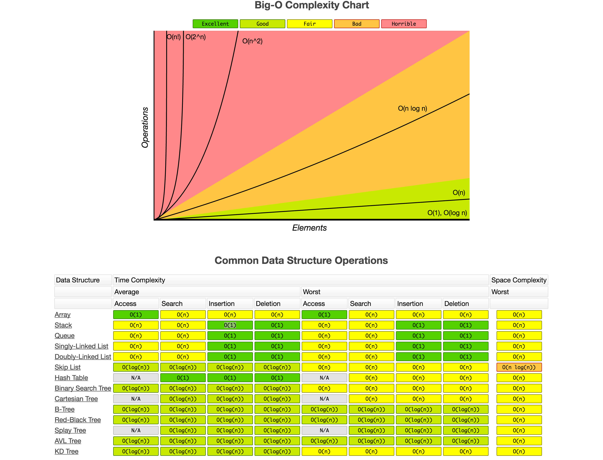

# 📌 Big O Notation 

Big O notation is a mathematical notation used to describe the efficiency of an algorithm in terms of time and space complexity. It helps us understand how an algorithm scales as the input size grows. 🚀

## 📖 Table of Contents
1. [Introduction to Big O](#introduction-to-big-o)
2. [Worst-Case Analysis](#worst-case-analysis)
3. [Common Big O Complexities](#common-big-o-complexities)
4. [Rules in Big O](#rules-in-big-o)
5. [Time Complexity: O, Ω, and Θ](#time-complexity-o-Ω-and-Θ)
6. [Big O Examples](#big-o-examples)

---

## 🔍 1. Introduction to Big O
Big O notation allows us to analyze how an algorithm scales in performance with increasing input size (**n**). Big O only considers the most significant factor in an expression to determine its efficiency.

Example:
- If an algorithm requires **5n + 10** operations, we simplify it to **O(n)** because constants are ignored in Big O.

---

## ⚠️ 2. Worst-Case Analysis
Big O focuses on the **worst-case scenario**, ensuring the algorithm remains efficient even for the largest inputs.

Example:
- Searching for an element in an unsorted array (Linear Search) has a worst-case complexity of **O(n)**.
- Searching in a Binary Search Tree (BST) has a complexity of **O(log n)** if balanced, but it can become **O(n)** in the worst case (unbalanced tree).

---

## 📊 3. Common Big O Complexities
Here are some common time complexities with examples:

| Big O Notation | Complexity Type | Example |
|--------------|----------------|---------|
| **O(1)** | Constant Time | Accessing an array element by index |
| **O(log n)** | Logarithmic Time | Binary Search |
| **O(n)** | Linear Time | Iterating through an array |
| **O(n log n)** | Log-Linear Time | Merge Sort, QuickSort (average case) |
| **O(n²)** | Quadratic Time | Nested loops (Bubble Sort, Selection Sort) |
| **O(2ⁿ)** | Exponential Time | Fibonacci (naïve recursion) |
| **O(n!)** | Factorial Time | Traveling Salesman Problem |

---

## 📝 4. Rules in Big O
Some key rules when simplifying Big O notation:

### 🎯 Rule 1: Drop Constants
- Example: **O(5n) → O(n)**, **O(1000) → O(1)**
- Constant factors are ignored because they do not affect scalability.

### 🎯 Rule 2: Drop Non-Dominant Terms
- Example: **O(n² + n) → O(n²)**
- Only consider the most significant term as **n** grows.

---

## ⏳ 5. Time Complexity: O, Ω, and Θ
When analyzing algorithm complexity, we often use three main notations:

| Notation | Description |
|---------|------------|
| **O (Big O, Upper Bound)** | Worst-case complexity, how slow an algorithm can be. |
| **Ω (Big Omega, Lower Bound)** | Best-case complexity, how fast an algorithm can be. |
| **Θ (Theta, Tight Bound)** | Average-case complexity, showing both upper and lower bounds. |

Example in Bubble Sort:
- **O(n²)** (Worst case: reversed array)
- **Ω(n)** (Best case: already sorted array)
- **Θ(n²)** (Average case complexity)

---

## 🛠️ 6. Big O Examples

### 📌 Example 1: O(n) - Linear Time

This code iterates through an array using a `for` loop, making its complexity **O(n)**.
```java
public class LinearExample {
    public static void main(String[] args) {
        int[] arr = {1, 2, 3, 4, 5};
        for (int num : arr) {
            System.out.println(num); // O(n)
        }
    }
}
```
**Output:**
```
1
2
3
4
5
```

---

### 📌 Example 2: O(1) - Constant Time

Accessing an array element by index always takes the same amount of time, making it **O(1)**.
```java
public class ConstantExample {
    public static void main(String[] args) {
        int[] arr = {10, 20, 30, 40};
        System.out.println(arr[2]); // O(1)
    }
}
```
**Output:**
```
30
```

---

### 📌 Example 3: O(log n) - Logarithmic Time

Binary Search divides the search space in half at each step, making its complexity **O(log n)**.
```java
public class BinarySearch {
    public static int binarySearch(int[] arr, int target) {
        int left = 0, right = arr.length - 1;
        while (left <= right) {
            int mid = left + (right - left) / 2;
            if (arr[mid] == target) {
                return mid;
            } else if (arr[mid] < target) {
                left = mid + 1;
            } else {
                right = mid - 1;
            }
        }
        return -1;
    }
    public static void main(String[] args) {
        int[] arr = {1, 3, 5, 7, 9};
        System.out.println(binarySearch(arr, 5)); // Output: 2
    }
}
```
**Output:**
```
2
```

---

### 📌 Example 4: O(n²) - Quadratic Time

Bubble Sort uses nested loops, leading to **O(n²)** complexity.
```java
public class BubbleSort {
    public static void bubbleSort(int[] arr) {
        int n = arr.length;
        for (int i = 0; i < n - 1; i++) {
            for (int j = 0; j < n - i - 1; j++) {
                if (arr[j] > arr[j + 1]) {
                    int temp = arr[j];
                    arr[j] = arr[j + 1];
                    arr[j + 1] = temp;
                }
            }
        }
    }
    public static void main(String[] args) {
        int[] arr = {5, 2, 9, 1, 5, 6};
        bubbleSort(arr);
        for (int num : arr) {
            System.out.print(num + " ");
        }
    }
}
```
**Output:**
```
1 2 5 5 6 9
```
---

## 🎯 Conclusion
Big O notation helps us analyze algorithm efficiency and choose the best one for our needs. Understanding these complexities is crucial for coding interviews and real-world applications.

### 🚀 Key Takeaways
✅ Drop constants and non-dominant terms.  
✅ Prefer algorithms with **O(1), O(log n), or O(n)**.  
✅ Understand worst-case scenarios in algorithm design.  

Happy Coding! 🎉



